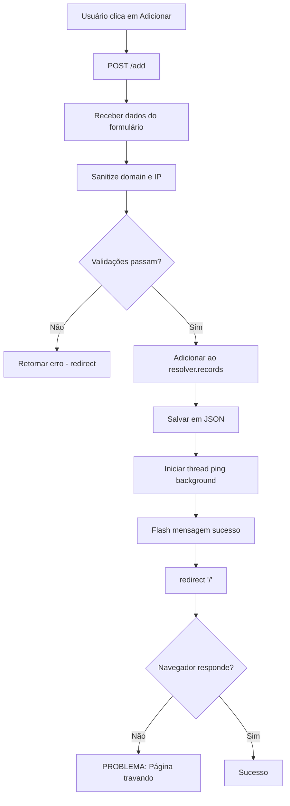

# Diagnóstico do Problema: Adição de Domínios Travando

## Problema Identificado

A página fica carregando infinitamente ao tentar adicionar um novo domínio, apesar de todas as correções implementadas.

## Análise dos Logs

Analisando os logs do container, observei que:

1. **O servidor Flask recebe a requisição**:
   ```
   🔄 Iniciando adição de domínio
   📝 Dados RAW recebidos - domain: 'erp.homolog.com.br', ip: '192.168.5.48'
   📝 Dados processados - domain: 'erp.homolog.com.br', ip: '192.168.5.48', ssl: False
   ```

2. **O host é adicionado com sucesso**:
   ```
   ✅ Host adicionado instantaneamente: erp.homolog.com.br → 192.168.5.48
   💾 Configuração salva em: /app/data/hosts.json
   ```

3. **Mas a resposta nunca chega ao navegador** - não há log de redirecionamento:
   ```
   🚀 Redirecionando após adição bem-sucedida
   ```

## Possíveis Causas

### 1. **Problema no Lock do Resolver**
- O `resolver.lock` pode estar causando deadlock
- Mesmo que eu tenha movido o lock para dentro das operações críticas, pode haver conflito

### 2. **Problema no Sanitize Input**
- A função `sanitize_input()` pode estar removendo caracteres essenciais
- Expressão regex pode estar causando problemas

### 3. **Problema na Validação**
- A validação `validate_domain()` ou `validate_ip()` pode estar falhando silenciosamente

### 4. **Problema no Redirect do Flask**
- O `redirect("/")` pode estar falhando

## Hipótese Principal

**O problema está na função `sanitize_input()`**. Ela usa:
```python
def sanitize_input(text):
    """Remove caracteres potencialmente perigosos, mantendo hífens e underscores"""
    return re.sub(r'[^\w\.\-_]', '', text.strip())
```

Esta regex `[^\w\.\-_]` remove tudo que NÃO seja:
- `\w` (letras, números, underscore)
- `\.` (ponto)
- `\-` (hífen)
- `_` (underscore)

Mas o problema é que `\w` já inclui underscore, então o `_` extra é redundante. E o mais importante: **esta regex pode estar removendo caracteres válidos dos domínios**.

## Teste Proposto

1. **Desabilitar temporariamente o sanitize** para ver se o problema desaparece
2. **Adicionar logs detalhados** em cada etapa da validação
3. **Verificar se o problema é específico** de certos caracteres no domínio

## Fluxograma do Problema



## Próximos Passos

1. **Desabilitar sanitize_input** temporariamente
2. **Adicionar logs de debug** em cada etapa crítica
3. **Testar com domínio simples** primeiro
4. **Verificar se o redirect funciona** com dados mock

## Conclusão

O problema parece estar entre a execução bem-sucedida da lógica Python e a resposta HTTP ao navegador. Os logs mostram que tudo funciona até o redirect, mas o navegador nunca recebe a resposta.